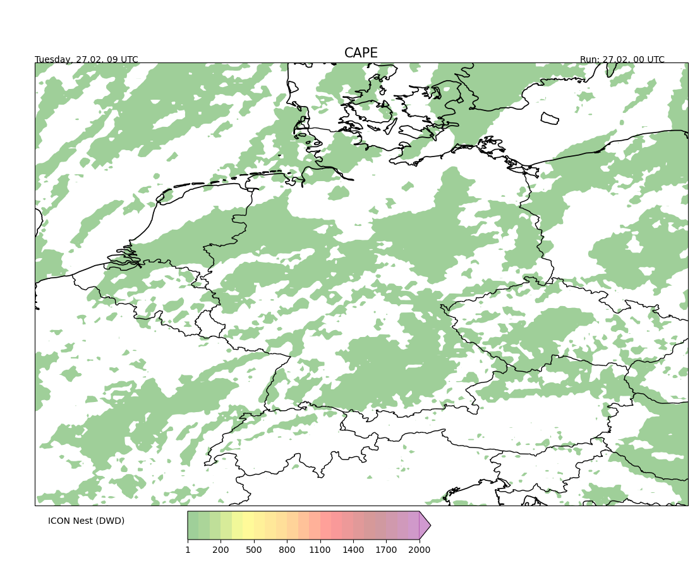

# HodographMaps

## Installation

**Conda**

```bash
conda env create -f environment.yml

conda activate HodographMaps
```


# Example Image




```bash
cd src
bash download_script.sh
conda activate HodographMaps
```
