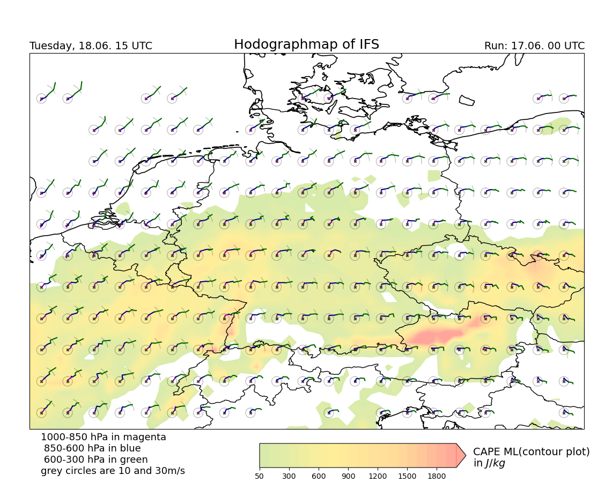

# HodographMaps

## Installation

**Conda**

```bash
conda env create -f environment.yml

conda activate HodographMaps
```

You need to addg Conda initialization to your etc/profile, as well.

## Example Image





## How to run

```bash
# plot Hodographs for leadtime 15
conda activate HodographMaps
bash run_script.sh 15
```
**Run past days:**
```bash
cd src
nano download_script.sh # change Date
bash download_script.sh
conda activate HodographMaps

# Plot Hodograph
python3 main.py IFS
python3 main.py GFS
python3 main.py ICON
cd images
```

## Datasource
- [ICON Nest](https://opendata.dwd.de/weather/nwp/icon-eu/)
- [IFS](https://www.ecmwf.int/en/forecasts/datasets/open-data)
- [GFS (NOAA)](https://www.nco.ncep.noaa.gov/pmb/products/gfs/)

## Cartopy?

- https://github.com/mammatus95/cartopy
- https://scitools.org.uk/cartopy/docs/latest/#

## License

This project is licensed under the terms of the MIT license. See the [LICENSE](LICENSE) file for details.

## [#ShowYourStripes](https://showyourstripes.info/s/globe)

<h4 align="center">
  <a href="https://showyourstripes.info/s/europe/germany/all">
    </a>
</h4>

**Graphics and Lead Scientist**: [Ed Hawkins](https://www.met.reading.ac.uk/~ed/home/index.php), National Centre for Atmospheric Science, University of Reading.

**Data**: Berkeley Earth, NOAA, UK Met Office, MeteoSwiss, DWD, SMHI, UoR, Meteo France & ZAMG.

<p>
<a href="https://showyourstripes.info/s/globe">#ShowYourStripes</a> is distributed under a
<a href="https://creativecommons.org/licenses/by/4.0/">Creative Commons Attribution 4.0 International License</a>
<a href="https://creativecommons.org/licenses/by/4.0/">
  </a>
</p>

