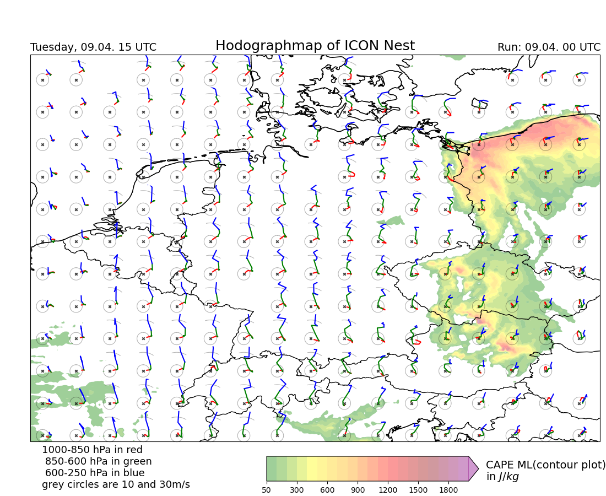

# HodographMaps

## Installation

**Conda**

```bash
conda env create -f environment.yml

conda activate HodographMaps
```


## Example Image




## How to run

```bash
cd src
bash download_script.sh
conda activate HodographMaps

# Plot Hodograph
python3 main.py Basic

# Plot Soundings
python3 main.py Sounding
```

## Cartopy?

- https://github.com/mammatus95/cartopy
- https://scitools.org.uk/cartopy/docs/latest/#

## Datasource
- ICON Nest: https://opendata.dwd.de/weather/nwp/icon-eu/
- IFS: https://www.ecmwf.int/en/forecasts/datasets/open-data

## License

This project is licensed under the terms of the MIT license. See the [LICENSE](LICENSE) file for details.
